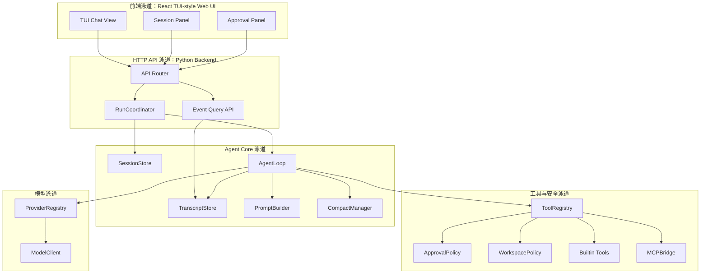
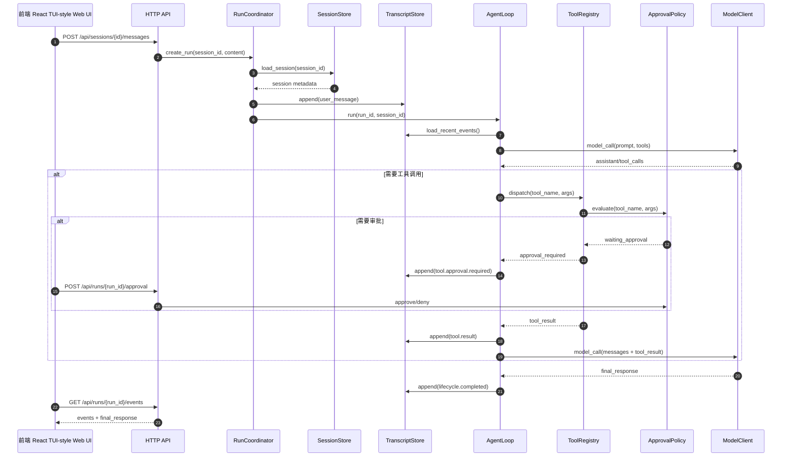
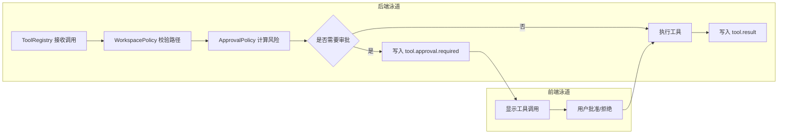
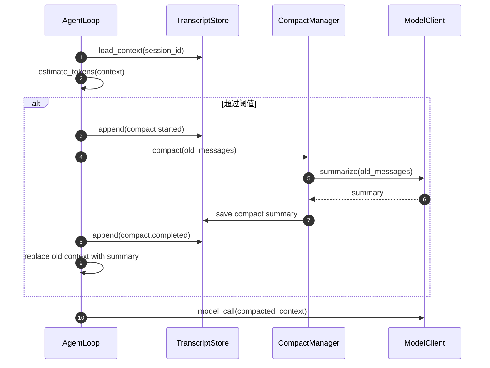

# V1.0 ccc 第一阶段 Coding Agent 模块概要设计说明书

> 文件模板编号：SFRD-TS-02
> 密级：B级（项目组内公开）
> 模板现行版本：V2.0

---

## 修订记录

| 修订版本号 | 作者 | 日期 | 简要说明 |
|-----------|------|------|---------|
| V1.0 | Codex | 20260614 | 基于 `设计文档.md`、`12-implementation-plan.md` 和模板起稿，覆盖第一阶段最小实现 |

---

## 1. 介绍

### 1.1 目的

本文档描述 `ccc`（Cross Code Companion）第一阶段 Coding Agent 的概要设计。`ccc` 的目标是实现一个类似 Codex / Claude Code 的本地代码智能体工具，第一阶段重点突出代码能力：读取仓库、理解上下文、调用模型、执行受控工具、修改文件、运行验证命令、持久化多 session 聊天记录，并通过基于 React 的 TUI 风格 Web 前端提供类似终端的交互体验。

本文档面向后端开发、前端开发、测试、架构评审和后续模块详细设计人员。本文档只覆盖第一阶段最小实现，不覆盖多用户、多平台 Gateway、复杂 automation、subagent、插件市场和云端执行。

### 1.2 定义和缩写

| 缩写/术语 | 全称 | 说明 |
|----------|------|------|
| ccc | Cross Code Companion | 本项目的本地 Coding Agent 工具名称，中文名暂定为“跨模型代码助手”。Cross 表示跨模型、跨工具、跨协议和跨工作流。 |
| AgentLoop | Agent Execution Loop | 一次用户请求从上下文组装、模型调用、工具调用到最终响应的执行循环。 |
| Session | 会话 | 单用户下的一个连续聊天/任务上下文，使用 UUID 标识。 |
| Run | 单次执行 | 用户在某个 session 中提交的一次任务，使用 `run_id` 标识。 |
| Transcript | 会话转录 | 按 JSONL 写入磁盘的用户消息、模型响应、工具调用和事件记录。 |
| Tool | 工具 | Agent 可调用的本地能力，包括文件读写、patch、命令执行等。 |
| Skill | 技能 | 可复用的过程说明或任务指导，第一阶段支持加载和显式引用，不支持自动改写。 |
| MCP | Model Context Protocol | 外部工具/数据源的标准接入协议，第一阶段预留并支持基础 client 接入。 |
| Compact | 上下文压缩 | 当 session 上下文超过阈值时，将历史消息压缩为摘要以降低 token 使用。 |
| Approval | 审批 | 高风险工具调用前的用户确认或策略拒绝。 |

### 1.3 参考和引用

| 序号 | 文档名称 | 文档编号 | 版本 |
|------|---------|---------|------|
| 1 | `ccc/design_docs/设计文档.md` | CCC-DESIGN-REQ | 当前版本 |
| 2 | `ccc/design_docs/模板-模块概要设计说明书.md` | SFRD-TS-02 | V2.0 |
| 3 | `docs/agent-lifecycle-study/12-implementation-plan.md` | CCC-AGENT-PLAN | 当前版本 |
| 4 | `docs/agent-lifecycle-study/11-minimal-reproduction.md` | CCC-AGENT-ABSTRACT | 当前版本 |
| 5 | OpenClaw / Hermes / Codex / Claude Code 生命周期研究小册子 | CCC-AGENT-STUDY | 当前版本 |

---

## 2. 设计任务书

第一阶段设计范围是本地单用户多 session Coding Agent。前端使用 React + pnpm 实现 TUI 风格 Web UI，后端使用 Python，前后端通过 HTTP 通信。第一阶段以最小可运行闭环为目标，必须完整覆盖聊天、session 持久化、工具注册与调用、模型调用、文件/命令工具安全控制、compact 和测试。

| 任务项 | 描述 | 来源 | 优先级 |
|--------|------|------|--------|
| 单用户多 session | 支持单用户创建、切换、恢复多个 session。 | `设计文档.md` | P0 |
| 聊天记录持久化 | 所有聊天、工具调用、事件写入 `{pwd}/sessions/{session_uuid}` 下 JSONL；单文件超过 10MB 分块。 | `设计文档.md` | P0 |
| AgentLoop | 支持模型调用、工具调用、工具结果回填、最终响应。 | 第一阶段实现方案 | P0 |
| 工具体系 | 支持内置 tools、扩展 tools、skills、MCP；工具可注册。 | `设计文档.md` | P0 |
| HTTP 通信 | 第一阶段前后端通过 HTTP API 通信。 | `设计文档.md` | P0 |
| React TUI 风格 Web 界面 | 前端用 React + pnpm 实现类似 Codex / Claude Code 终端体验的 Web UI；第一阶段不是运行在终端里的真实 TUI。 | `设计文档.md` | P0 |
| Compact | 上下文超过阈值时触发 compact，第一阶段只做摘要压缩，不做长期 memory。 | `设计文档.md` | P0 |
| 审批与安全 | 文件写入、命令执行等高风险工具必须经过策略控制。 | 第一阶段实现方案 | P0 |
| 异常处理 | 明确模型失败、工具失败、session 写入失败、compact 失败、HTTP 中断等异常策略。 | 用户要求 | P0 |
| 完整测试 | 单元测试、接口测试、异常场景测试必须通过。 | `设计文档.md` | P0 |

---

## 3. 对外接口

### 3.1 API 接口

| 接口名称 | 输入参数 | 输出参数 | 功能说明 | 备注 |
|----------|---------|---------|---------|------|
| `POST /api/sessions` | `cwd?: string` | `session_id`, `created_at` | 创建新 session。 | 默认 cwd 为后端启动目录。 |
| `GET /api/sessions` | 无 | `sessions[]` | 查询本地已有 session。 | 单用户，无鉴权。 |
| `GET /api/sessions/{session_id}` | `session_id` | session metadata, recent messages | 查询 session 元信息和最近消息。 | transcript 分页加载。 |
| `POST /api/sessions/{session_id}/messages` | `content`, `options?` | `run_id` | 提交用户消息并启动一次 run。 | 返回后可轮询或读取事件流。 |
| `GET /api/runs/{run_id}` | `run_id` | run status, final response | 查询 run 状态。 | 用于页面恢复。 |
| `GET /api/runs/{run_id}/events` | `run_id`, `cursor?` | `events[]`, `next_cursor` | 拉取 run 事件。 | 第一阶段用 HTTP 轮询；后续可切 SSE。 |
| `POST /api/runs/{run_id}/approval` | `decision`, `approval_id` | decision result | 对待审批工具调用批准或拒绝。 | 高风险工具调用阻塞等待。 |
| `POST /api/runs/{run_id}/stop` | `reason?` | stop result | 中断 run。 | 设置 cancel flag。 |
| `GET /api/tools` | 无 | `tools[]` | 查看已注册工具。 | 包含 builtin、extension、MCP。 |
| `GET /api/health` | 无 | status | 健康检查。 | 调测与测试使用。 |

#### 3.1.1 `POST /api/sessions/{session_id}/messages`

- **功能**：向指定 session 发送用户消息，创建 run，并进入 AgentLoop。
- **调用方**：React 前端。
- **输入参数**：
  - `content: string`，用户输入。
  - `options.cwd?: string`，本次执行工作目录，必须在允许范围内。
  - `options.model?: string`，可选模型名。
  - `options.compact_threshold_bytes?: number`，可选 compact 阈值覆盖。
- **输出参数**：
  - `run_id: string`
  - `status: "queued" | "running"`
- **前置条件**：
  - `session_id` 存在。
  - session 目录可读写。
  - 当前 session 没有不可并发的 active run。
- **后置条件**：
  - transcript 写入 `user_message` 事件。
  - run metadata 写入 session 目录。
  - run 进入 queued 或 running 状态。
- **错误码**：
  - `404 SESSION_NOT_FOUND`
  - `409 SESSION_BUSY`
  - `422 INVALID_MESSAGE`
  - `507 SESSION_STORAGE_FULL`
  - `500 RUN_CREATE_FAILED`

#### 3.1.2 `GET /api/runs/{run_id}/events`

- **功能**：获取 run 的事件流快照，用于前端 TUI 风格渲染。
- **调用方**：React 前端。
- **输入参数**：
  - `run_id: string`
  - `cursor?: string`
- **输出参数**：
  - `events: Event[]`
  - `next_cursor: string`
  - `done: boolean`
- **前置条件**：
  - `run_id` 存在。
- **后置条件**：
  - 不修改业务状态。
- **错误码**：
  - `404 RUN_NOT_FOUND`
  - `410 EVENT_LOG_ROTATED`
  - `500 EVENT_READ_FAILED`

#### 3.1.3 `POST /api/runs/{run_id}/approval`

- **功能**：批准或拒绝高风险工具调用。
- **调用方**：React 前端。
- **输入参数**：
  - `approval_id: string`
  - `decision: "approve" | "deny"`
  - `comment?: string`
- **输出参数**：
  - `accepted: boolean`
- **前置条件**：
  - run 正在等待审批。
  - `approval_id` 未过期。
- **后置条件**：
  - 写入 `approval_decision` 事件。
  - AgentLoop 继续执行或将工具结果标记为拒绝。
- **错误码**：
  - `404 APPROVAL_NOT_FOUND`
  - `409 APPROVAL_ALREADY_DECIDED`
  - `409 RUN_NOT_WAITING_APPROVAL`

### 3.2 消息接口

第一阶段内部消息以事件形式写入 transcript/event log，并通过 HTTP 轮询给前端。

| 消息名称 | 方向（发送/接收） | 消息格式 | 触发条件 | 说明 |
|----------|-----------------|---------|---------|------|
| `lifecycle.started` | 后端发送 | JSON object | run 启动 | 包含 `run_id`、`session_id`、`cwd`。 |
| `assistant.delta` | 后端发送 | JSON object | 模型流式输出 | 第一阶段如 provider 不支持流式，可聚合后一次发送。 |
| `tool.call.pending` | 后端发送 | JSON object | 模型请求调用工具 | 包含工具名、参数摘要、风险级别。 |
| `tool.approval.required` | 后端发送 | JSON object | 工具调用需要审批 | 前端显示确认/拒绝控件。 |
| `tool.result` | 后端发送 | JSON object | 工具执行完成 | 包含 stdout/stderr/result/error 摘要。 |
| `compact.started` | 后端发送 | JSON object | 上下文超过阈值 | 表示开始压缩历史上下文。 |
| `compact.completed` | 后端发送 | JSON object | 压缩完成 | 包含摘要引用。 |
| `lifecycle.completed` | 后端发送 | JSON object | run 成功完成 | 包含 final response。 |
| `lifecycle.failed` | 后端发送 | JSON object | run 失败 | 包含错误码和可恢复建议。 |

### 3.3 调测接口

#### 3.3.1 调试工具接口

| 接口/命令 | 功能说明 | 使用场景 |
|----------|---------|---------|
| `GET /api/health` | 检查后端进程、session 根目录、模型配置状态。 | 前端启动和运维检查。 |
| `GET /api/tools` | 查看工具注册表。 | 调试工具加载和扩展工具注册。 |
| `GET /api/sessions/{id}` | 查看 session metadata 和最近消息。 | 排查 session 恢复、历史缺失。 |
| `GET /api/runs/{id}` | 查看 run 状态。 | 排查执行卡住、审批等待、失败原因。 |

#### 3.3.2 测试工具接口

| 接口/命令 | 功能说明 | 使用场景 |
|----------|---------|---------|
| `pytest` | 后端单元测试和接口测试。 | CI 和本地验证。 |
| `pnpm test` | 前端组件和交互测试。 | CI 和本地验证。 |
| `pnpm lint` | 前端静态检查。 | CI。 |
| `pytest tests/e2e` | 端到端异常场景测试。 | 发布前验证。 |

---

## 4. 概要说明

### 4.1 背景描述

#### 4.1.1 工作原理

`ccc` 第一阶段采用前后端分离架构。React 前端负责 TUI 风格 Web 交互、session 列表、聊天消息、工具调用展示和审批按钮；Python 后端负责 session 管理、AgentLoop、模型 provider、工具注册与执行、compact、事件记录和 HTTP API。

每次用户输入会被后端转换为一次 run。AgentLoop 加载 session 历史、repo guidance、可用工具 schema 和 compact 摘要，调用模型。模型返回工具调用时，ToolRegistry 根据工具名分发到内置工具或扩展工具；工具执行前经过 WorkspacePolicy 和 ApprovalPolicy。工具结果写回 transcript，并作为 tool result 回填给模型，直到模型产生最终响应或出现终止异常。

#### 4.1.2 应用场景

- 在本地代码仓库中询问项目结构和测试入口。
- 让 agent 修改单个 bug 或小型功能。
- 让 agent 运行测试命令并根据失败信息继续修复。
- 在多个 session 中分别处理不同任务。
- 审批高风险 shell 命令或文件写入。
- 当长上下文超过阈值时自动 compact。

#### 4.1.3 竞品/对手分析

| 对比项 | 本方案 | 竞品方案 | 分析 |
|--------|-------|---------|------|
| 本地代码能力 | 第一阶段聚焦本地 repo、文件工具、命令执行和 session。 | Codex / Claude Code 均以本地 coding agent 为核心体验。 | 本方案优先补齐核心闭环，不先做复杂平台能力。 |
| 长生命周期控制面 | 第一阶段保留 run/session/event 抽象，第三阶段再服务化。 | OpenClaw 强于 Gateway、queue、event control plane。 | 避免第一版被 Gateway 复杂度拖慢，但接口预留。 |
| memory / skills | 第一阶段支持 skills 和 compact，memory 只保留接口。 | Hermes 强于 memory、skills lifecycle、cron safety。 | 先做可控上下文压缩，避免早期 memory 污染。 |
| 工具扩展 | ToolRegistry + MCPBridge 预留。 | Codex / Claude Code 重视 MCP。 | 第一阶段内置工具可用，第二阶段接 MCP。 |

### 4.2 方案选型

#### 4.2.1 入口形态选型

| 方案 | 优点 | 缺点 | 结论 |
|------|------|------|------|
| CLI-only | 实现最快，接近第一阶段最小闭环。 | 不符合当前 React + HTTP 前端要求。 | 不采用为唯一入口。 |
| React + HTTP API | 符合当前设计文档；便于做 TUI 风格 Web UI、审批和事件展示。 | 比 CLI-only 多一层前后端通信；不是真正的终端 TUI。 | 第一阶段采用。 |
| Ink/Terminal TUI | 可以用 React 模型开发真正运行在终端里的 TUI。 | 输入、滚动、复杂布局和审批交互成本更高；需额外 Node CLI runtime。 | 后续作为 CLI 入口补充。 |
| Gateway daemon + WebSocket | 长期能力强，接近 OpenClaw。 | 第一阶段复杂度过高。 | 后续阶段再做。 |

**选型结论**：第一阶段采用 React + HTTP API，交付“基于 React 的 TUI 风格 Web 前端”。后端内部仍保留 `IngressSurface` 抽象，方便未来增加 Ink/Terminal TUI、CLI、SSE、WebSocket 或 SDK。

#### 4.2.2 事件传输选型

| 方案 | 优点 | 缺点 | 结论 |
|------|------|------|------|
| HTTP 轮询 | 简单稳定，符合第一阶段 HTTP 要求。 | 实时性弱，事件量大时开销高。 | 第一阶段采用。 |
| SSE | 实时性好，适合 run events。 | 前后端异常恢复稍复杂。 | 第二阶段可替换。 |
| WebSocket | 双向实时，适合 Gateway。 | 第一阶段过重。 | 暂不采用。 |

**选型结论**：第一阶段使用 `GET /api/runs/{run_id}/events?cursor=` 轮询；事件模型按 SSE/WebSocket 可迁移方式设计。

#### 4.2.3 会话存储选型

| 方案 | 优点 | 缺点 | 结论 |
|------|------|------|------|
| 纯 JSONL | 易审计，追加写简单。 | 查询 session 列表和状态不方便。 | 只用于 transcript/events。 |
| SQLite + JSONL | SQLite 管 metadata，JSONL 管事件；兼顾查询和审计。 | 实现略复杂。 | 第一阶段采用。 |
| 全 SQLite | 查询强。 | 大文本事件和分块审计不如 JSONL 直观。 | 暂不采用。 |

**选型结论**：SQLite 保存 session/run metadata，JSONL 保存 transcript/events；单 JSONL 文件超过 10MB 分块。

### 4.3 静态结构

#### 4.3.1 模块总体结构



| 子模块/组件 | 职责说明 |
|------------|---------|
| React TUI-style Web UI | 聊天界面、session 切换、事件展示、审批交互；以 Web UI 承载终端风格体验。 |
| API Router | HTTP 路由、参数校验、错误码转换。 |
| RunCoordinator | 创建 run、检查 session busy、调度 AgentLoop。 |
| SessionStore | 管理 session metadata、session 根目录、resume。 |
| TranscriptStore | 追加写 JSONL 事件，处理 10MB 分块。 |
| AgentLoop | 核心模型/工具执行循环。 |
| PromptBuilder | 组装 system prompt、session 摘要、工具 schema。 |
| CompactManager | 超阈值上下文压缩。 |
| ToolRegistry | 工具注册、schema 输出、工具分发。 |
| ApprovalPolicy | 高风险工具审批策略。 |
| WorkspacePolicy | 文件系统访问边界。 |
| ProviderRegistry | 模型 provider 选择。 |
| ModelClient | 调用具体模型 API。 |

#### 4.3.2 元数据定义

| 元数据名称 | 类型 | 存储位置 | 说明 |
|-----------|------|---------|------|
| `session_id` | UUID string | SQLite / session 目录名 | 会话唯一标识。 |
| `run_id` | UUID string | SQLite / event JSONL | 单次执行唯一标识。 |
| `session_root` | path | `{pwd}/sessions/{session_id}` | session 文件根目录。 |
| `jsonl_chunk_index` | int | session metadata | 当前 transcript 分块序号。 |
| `run_status` | enum | SQLite | `queued/running/waiting_approval/completed/failed/cancelled`。 |
| `approval_id` | UUID string | SQLite / event JSONL | 待审批工具调用标识。 |
| `compact_summary_id` | string | session metadata | 最近一次 compact 摘要引用。 |

#### 4.3.3 全局选项/配置定义

| 配置项 | 默认值 | 取值范围 | 说明 |
|--------|-------|---------|------|
| `sessions.root` | `{pwd}/sessions` | 本地可写路径 | session 根目录。 |
| `sessions.chunk_size_mb` | `10` | `1-100` | JSONL 分块大小。 |
| `agent.max_iterations` | `20` | `1-100` | 单次 run 最大模型/工具循环次数。 |
| `agent.compact_threshold_tokens` | `80000` | 正整数 | 触发 compact 的估算 token 阈值。 |
| `tools.command_timeout_sec` | `120` | `1-3600` | shell 命令超时。 |
| `workspace.mode` | `workspace-write` | `read-only/workspace-write/danger-full-access` | 文件系统权限模式。 |
| `approval.default_shell` | `prompt` | `allow/prompt/deny` | shell 工具默认审批策略。 |
| `http.host` | `127.0.0.1` | IP/hostname | 后端监听地址。 |
| `http.port` | `8642` | `1-65535` | 后端监听端口。 |

#### 4.3.4 数据组织形式

```text
{pwd}/
  sessions/
    sessions.sqlite
    {session_uuid}/
      metadata.json
      transcript-0001.jsonl
      transcript-0002.jsonl
      compact/
        compact-{timestamp}.md
      artifacts/
        tool-{run_id}-{tool_name}.json
```

JSONL 每行是一条事件，必须包含：

```json
{
  "event_id": "uuid",
  "session_id": "uuid",
  "run_id": "uuid",
  "type": "tool.result",
  "ts": "2026-06-14T19:00:00+08:00",
  "payload": {}
}
```

#### 4.3.5 边界约束

| 约束项 | 约束值 | 说明 |
|--------|-------|------|
| 用户模型 | 单用户 | 第一阶段不做多用户和鉴权。 |
| session 并发 | 同一 session 同时只允许一个 active run | 避免 transcript 并发写乱。 |
| JSONL 分块 | 10MB | 超过阈值滚动到下一分块。 |
| 工具执行目录 | 默认限制在 cwd/workspace 内 | `danger-full-access` 需显式配置。 |
| 命令超时 | 默认 120 秒 | 超时后终止进程并记录 tool error。 |
| compact | 只做上下文摘要 | 不做长期 memory、dreaming、curator。 |
| 通信方式 | HTTP | 第一阶段不使用 WebSocket。 |

### 4.4 基本处理流程

#### 4.4.1 用户提交消息并执行 AgentLoop

**流程描述**：前端提交用户消息，后端创建 run，加载 session，上下文组装，调用模型，按需执行工具，写入事件，返回最终结果。



**关键步骤**：

1. API 校验 `session_id`、消息内容和 session busy 状态。
2. RunCoordinator 创建 `run_id`，写入 `user_message` 事件。
3. AgentLoop 读取上下文，检查 compact 阈值。
4. ModelClient 调用模型，返回 assistant 文本或 tool calls。
5. ToolRegistry 执行工具；高风险工具进入 ApprovalPolicy。
6. 工具结果回填模型，直到 final response、失败、取消或超过最大循环次数。
7. TranscriptStore 追加写所有事件，前端轮询渲染。

**异常处理**：

| 异常场景 | 检测点 | 处理策略 | 用户可见反馈 |
|----------|--------|----------|--------------|
| session 不存在 | API 参数校验 | 返回 `404 SESSION_NOT_FOUND`。 | 提示 session 已不存在，要求新建或刷新列表。 |
| 同 session 已有 active run | RunCoordinator | 返回 `409 SESSION_BUSY`。 | 提示当前会话正在执行，可停止或等待。 |
| 模型调用超时 | ModelClient | 记录 `model.error`，按 provider retry 策略重试；仍失败则 run failed。 | 展示模型超时和重试次数。 |
| 模型返回非法 tool call | AgentLoop | 写入 tool error result，引导模型自修正；超过阈值后失败。 | 展示“模型工具调用格式错误”。 |
| 工具不存在 | ToolRegistry | 返回结构化 tool error 给 AgentLoop。 | 展示 unknown tool。 |
| 工具执行超时 | ToolRegistry | 终止工具进程，写入 `tool.result` error。 | 展示命令超时。 |
| 工具被拒绝 | ApprovalPolicy | 将拒绝结果作为 tool result 回填模型。 | 展示用户已拒绝。 |
| transcript 写入失败 | TranscriptStore | 停止 run，返回 `TRANSCRIPT_WRITE_FAILED`；不继续执行工具。 | 提示磁盘写入失败，建议检查权限/空间。 |
| 前端请求中断 | HTTP API | 后端 run 不因普通轮询中断自动停止。 | 刷新后可通过 run 状态恢复。 |
| run 被停止 | Stop API / cancel flag | AgentLoop 在模型调用前、工具调用前检查 cancel flag。 | 展示 run cancelled。 |

#### 4.4.2 工具调用审批流程

**流程描述**：ToolRegistry 在执行工具前根据工具类型、参数和 workspace policy 计算风险。低风险直接执行，高风险暂停 run 并向前端发送审批事件。



**关键步骤**：

1. `read_file/list_files` 默认低风险。
2. `write_file/edit_file/apply_patch` 必须在 workspace 内。
3. `run_command` 按命令模式分级，删除、权限修改、网络下载、后台进程默认高风险。
4. 审批事件必须写入 transcript。
5. 审批结果也必须写入 transcript。

**异常处理**：

- 路径越界：直接拒绝，错误码 `WORKSPACE_VIOLATION`。
- 审批超时：默认拒绝，错误码 `APPROVAL_TIMEOUT`。
- 重复审批提交：返回 `409 APPROVAL_ALREADY_DECIDED`。
- 工具执行过程中 run 被取消：终止工具并写入 `TOOL_CANCELLED`。

#### 4.4.3 Compact 流程

**流程描述**：AgentLoop 在模型调用前估算上下文大小。超过阈值时调用 CompactManager 对旧消息生成摘要，并将摘要保存到 session 的 `compact/` 目录。



**异常处理**：

| 异常场景 | 处理策略 |
|----------|----------|
| compact 模型调用失败 | 保留原上下文，若仍超过模型上限则返回 `COMPACT_FAILED_CONTEXT_TOO_LARGE`。 |
| compact 摘要写入失败 | 停止 run，避免使用无法追溯的隐式摘要。 |
| 摘要为空 | 视为 compact 失败，不覆盖现有 compact。 |
| compact 后仍超限 | 继续压缩更早历史；最多两轮，仍失败则停止。 |

### 4.5 可调试性机制分析及设计

#### 4.5.1 日志设计

日志分为两类：

- 应用日志：后端标准日志，记录 API、run 状态、错误栈、工具执行摘要。
- 事件日志：session JSONL transcript，记录可审计的业务事件。

关键日志点：

| 日志点 | 级别 | 内容 |
|--------|------|------|
| session 创建 | INFO | `session_id`, `cwd` |
| run 创建/完成/失败 | INFO/ERROR | `run_id`, `session_id`, `status`, `error_code` |
| 模型调用 | INFO/WARN/ERROR | provider、model、耗时、retry 次数 |
| 工具调用 | INFO/WARN | tool name、风险级别、耗时、退出码 |
| 审批 | INFO | approval id、decision |
| compact | INFO/WARN/ERROR | 阈值、摘要大小、失败原因 |

#### 4.5.2 统计与监控

| 指标名称 | 类型 | 含义 | 采集方式 |
|----------|------|------|---------|
| `runs_total` | counter | run 总数。 | RunCoordinator。 |
| `runs_failed_total` | counter | 失败 run 总数。 | RunCoordinator。 |
| `tool_calls_total` | counter | 工具调用次数。 | ToolRegistry。 |
| `tool_failures_total` | counter | 工具失败次数。 | ToolRegistry。 |
| `approval_required_total` | counter | 需要审批次数。 | ApprovalPolicy。 |
| `compact_total` | counter | compact 次数。 | CompactManager。 |
| `model_latency_ms` | histogram | 模型调用耗时。 | ModelClient。 |

#### 4.5.3 资源监控与控制

- 单 run 最大循环次数：默认 20。
- 单工具执行超时：默认 120 秒。
- transcript 单文件大小：10MB 分块。
- 同 session active run：最多 1 个。
- 后端启动时检查 session 根目录可写。
- 命令执行默认继承受控环境变量，不透传敏感变量清单以外的内容。

#### 4.5.4 辅助工具

| 工具 | 用途 |
|------|------|
| `ccc doctor` | 检查 session 目录、模型配置、工具注册表。 |
| `ccc inspect-session <id>` | 查看 session metadata 和 transcript 分块。 |
| `ccc replay-run <run_id>` | 基于 transcript 复盘 run 事件，不重新执行工具。 |

### 4.6 可测试性机制分析及设计

#### 4.6.1 单元测试方案

覆盖策略：

- `SessionStore`：创建、恢复、损坏 metadata、目录不可写。
- `TranscriptStore`：追加写、10MB 分块、JSONL 格式、写入失败。
- `ToolRegistry`：注册、重复工具名、未知工具、工具异常。
- `ApprovalPolicy`：低风险直通、高风险审批、拒绝、超时。
- `WorkspacePolicy`：路径越界、软链接逃逸、read-only 写入。
- `CompactManager`：超阈值触发、摘要失败、摘要为空。
- `AgentLoop`：正常工具闭环、非法 tool call、最大循环次数、取消。

#### 4.6.2 接口测试方案

接口测试覆盖：

- 创建 session。
- 提交消息并产生 run。
- 轮询 run events。
- 工具审批批准/拒绝。
- 停止 run。
- session 不存在。
- session busy。
- transcript 写入失败模拟。
- compact 失败模拟。

### 4.7 可扩展与可复用设计

- ToolRegistry 使用统一 `ToolDefinition`，内置工具和扩展工具同一注册路径。
- MCPBridge 通过 adapter 接入，避免污染 ToolRegistry 内核。
- ProviderRegistry 把模型 API 差异隔离在 provider adapter。
- IngressSurface 抽象保留 CLI、HTTP、SSE、WebSocket、SDK 的扩展空间。
- TranscriptStore 使用事件模型，方便未来切换 SSE/WebSocket 和 replay。
- CompactManager 独立于 MemoryStore，避免第一阶段把压缩摘要误当长期 memory。

### 4.8 可靠性与稳定性设计

- transcript 先写用户消息再启动 run，避免用户输入丢失。
- 工具调用前写 `tool.call.pending`，工具结束后写 `tool.result`，方便故障复盘。
- session JSONL 采用追加写；每条 JSON 单行，写入后 flush。
- JSONL 分块使用递增编号，分块切换写入 metadata。
- run 状态机只允许合法迁移：
  - `queued -> running`
  - `running -> waiting_approval`
  - `waiting_approval -> running`
  - `running -> completed/failed/cancelled`
- 后端重启后，处于 `running/waiting_approval` 的 run 标记为 `failed`，错误码 `PROCESS_RESTARTED`。

### 4.9 安全性设计

- 第一阶段单用户，但仍限制 HTTP 默认只监听 `127.0.0.1`。
- workspace-write 模式下禁止写 workspace 外路径。
- 对软链接解析真实路径，防止 path escape。
- shell 命令默认审批。
- 危险命令拒绝或必须审批，例如 `rm -rf /`、`chmod -R`、`curl | sh`。
- transcript 中工具输出按大小截断，完整输出可存 artifacts。
- 不在日志中打印 API key。
- MCP tool 默认按外部工具处理，必须有 timeout 和 approval mode。

### 4.10 跨平台设计和平台差异处理

第一阶段支持 Linux/macOS 优先。Windows 后续适配。

| 差异项 | Linux/macOS | Windows 后续策略 |
|--------|-------------|------------------|
| shell | 默认 `/bin/sh` 或用户配置 shell。 | 使用 PowerShell adapter。 |
| 路径 | POSIX path。 | 使用 `pathlib` 统一真实路径解析。 |
| 进程终止 | process group terminate。 | Job Object 或进程树终止。 |
| 文件锁 | 原子写 + metadata 状态控制。 | 增加平台锁实现。 |

---

## 5. 数据结构设计

### 5.1 配置文件定义

配置文件路径：`.ccc/config.toml`。

```toml
[http]
host = "127.0.0.1"
port = 8642

[sessions]
root = "./sessions"
chunk_size_mb = 10

[agent]
max_iterations = 20
compact_threshold_tokens = 80000

[workspace]
mode = "workspace-write"

[tools]
command_timeout_sec = 120

[approval]
default_shell = "prompt"

[providers.default]
type = "openai"
model = "gpt-5.4"

[[mcp.servers]]
name = "filesystem"
transport = "stdio"
command = "node"
args = ["./mcp/filesystem.js"]
enabled = false
```

### 5.2 核心数据结构定义

```python
from dataclasses import dataclass
from enum import Enum
from typing import Any, Literal

class RunStatus(str, Enum):
    QUEUED = "queued"
    RUNNING = "running"
    WAITING_APPROVAL = "waiting_approval"
    COMPLETED = "completed"
    FAILED = "failed"
    CANCELLED = "cancelled"

@dataclass
class SessionMeta:
    session_id: str
    cwd: str
    created_at: str
    updated_at: str
    current_chunk: int
    compact_summary_id: str | None

@dataclass
class RunMeta:
    run_id: str
    session_id: str
    status: RunStatus
    created_at: str
    updated_at: str
    error_code: str | None = None
    final_response: str | None = None

@dataclass
class Event:
    event_id: str
    session_id: str
    run_id: str
    type: str
    ts: str
    payload: dict[str, Any]

@dataclass
class ToolDefinition:
    name: str
    description: str
    input_schema: dict[str, Any]
    risk_level: Literal["low", "medium", "high"]
    timeout_sec: int

@dataclass
class ToolResult:
    tool_call_id: str
    ok: bool
    content: str
    error_code: str | None = None
    metadata: dict[str, Any] | None = None

@dataclass
class ApprovalRequest:
    approval_id: str
    run_id: str
    tool_name: str
    args_preview: dict[str, Any]
    risk_reason: str
    status: Literal["pending", "approved", "denied", "expired"]
```

---

## 6. 变更控制

编码过程中对原设计的调整需在此记录，经项目负责人确认。

| 变更章节 | 变更内容 | 变更原因 | 对老功能/原有设计的影响 |
|----------|---------|---------|---------------------|
| 无 | 初始版本，无变更。 | 初始设计。 | 无。 |
